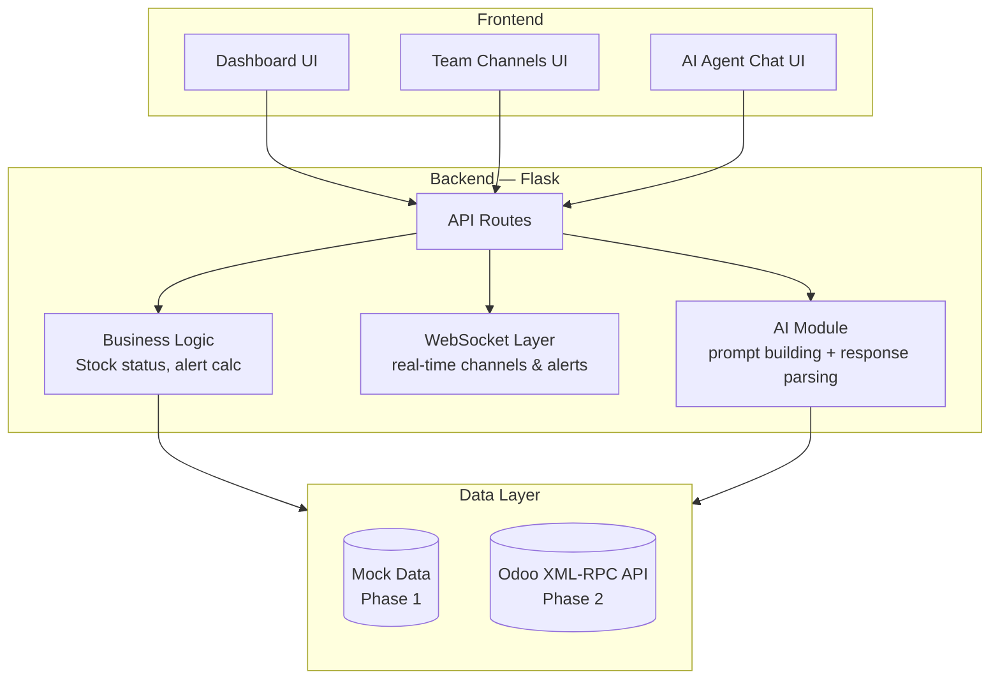
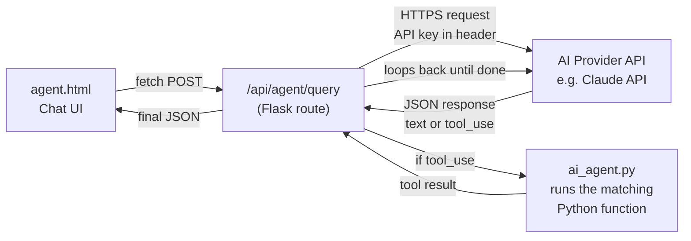
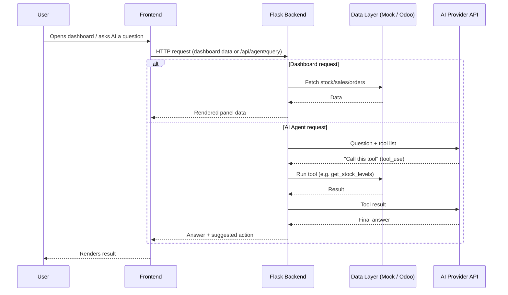

# Architecture

This document covers how Jodo is structured — the layers, the tech stack, how the pieces talk to each other, and how the AI agent connects to the backend.

---

## 1. High-Level Architecture



**Three layers, kept intentionally simple:**

1. **Frontend** — HTML/CSS/JS + Jinja2 templates. No React, no heavy frameworks.
2. **Backend** — Python + Flask. Routes, business logic, WebSocket, and the AI module all live here.
3. **Data layer** — starts as mock data, swapped for live Odoo data later without touching the frontend or the AI logic.

---

## 2. Tech Stack

| Layer | Technology | Why |
|---|---|---|
| Frontend | HTML, CSS, JavaScript | Simple, no build step needed |
| Templating | Jinja2 | Ships with Flask, connects backend data → HTML directly |
| Backend | Python, Flask | Lightweight, fast to iterate on for a project this size |
| Real-time | WebSocket / Polling | Powers live channel messages and live alert updates |
| AI | LLM API (e.g. Claude API) with function calling | No model training — we ground a ready-made model in our own data |
| Data (now) | Mock data (`mock_data.py`) | Lets frontend/backend development move without a live ERP |
| Data (later) | Odoo XML-RPC API | Real operational data once integration is ready |

We deliberately avoided a database like Postgres/MySQL for now — Odoo *is* the database, we just talk to it via XML-RPC once Phase 5 starts.

---

## 3. How We're Connecting the AI (API-level)

This is the plumbing behind the AI Agent feature — how Flask talks to the AI provider.

### 3.1 Connection overview



### 3.2 What's needed to connect

| Item | Purpose |
|---|---|
| API key | Stored in `.env` (never committed) — e.g. `ANTHROPIC_API_KEY=...` |
| HTTPS endpoint | The provider's chat/completions endpoint, called over `requests`/`httpx` from Flask |
| Tool schema | JSON description of each tool (`get_stock_levels`, `raise_reorder`, etc.) sent along with every request so the AI knows what it can call |
| `.env.example` | Shows the required variable names without exposing real keys |

### 3.3 Simplified connection code (Flask side)

```python
# ai_agent.py
import os, requests

API_KEY = os.getenv("ANTHROPIC_API_KEY")
API_URL = "https://api.anthropic.com/v1/messages"

TOOLS = [
    {"name": "get_stock_levels", "description": "Get current stock for products", "input_schema": {...}},
    {"name": "raise_reorder", "description": "Create a reorder request", "input_schema": {...}},
    # ...other tools
]

def ask_agent(user_message, conversation_history):
    response = requests.post(
        API_URL,
        headers={
            "x-api-key": API_KEY,
            "content-type": "application/json"
        },
        json={
            "model": "claude-sonnet-4-6",
            "max_tokens": 1000,
            "messages": conversation_history + [{"role": "user", "content": user_message}],
            "tools": TOOLS
        }
    )
    return response.json()
```

```python
# app.py
from ai_agent import ask_agent, run_tool

@app.route("/api/agent/query", methods=["POST"])
def agent_query():
    user_message = request.json["message"]
    history = []

    result = ask_agent(user_message, history)

    # loop: keep calling tools until AI gives a final text answer
    while result_has_tool_call(result):
        tool_name, tool_input = extract_tool_call(result)
        tool_output = run_tool(tool_name, tool_input)   # runs our Python function
        history.append({"role": "assistant", "content": result["content"]})
        history.append({"role": "user", "content": tool_output})
        result = ask_agent(user_message, history)

    return jsonify(final_answer=extract_text(result))
```

### 3.4 Key points about the connection

- **One request per "thinking step"** — the loop sends a request, checks if the AI wants a tool, runs it, sends the result back, and repeats until the AI gives a final text answer.
- **API key is server-side only** — the frontend never talks to the AI API directly, it only talks to our own Flask route (`/api/agent/query`), keeping the key safe.
- **Mock data first** — during Phase 1–3, `run_tool()` reads from `mock_data.py`; in Phase 5 it's swapped to call `odoo_client.py` instead, without changing anything about how the AI connects.
- **Real-time delivery** — a final answer can be returned directly (simple HTTP response) or pushed over WebSocket if we want live "typing" style updates in the chat UI.

---

## 4. Data Flow — End to End



---

## 5. Why This Architecture

- **Flask over something heavier** — the project doesn't need a full microservice split yet; one backend app is enough to serve dashboards, channels, and the AI route.
- **Mock data first** — decouples frontend/backend progress from Odoo integration, so both can move in parallel.
- **Tool-based AI instead of one big prompt** — keeps answers grounded in real numbers instead of the model guessing, and lets the AI take multi-step actions (fetch → reason → act) instead of one-shot replies.
- **WebSocket for real-time, not for everything** — only channels and live alerts need it; regular dashboard loads and AI queries are simple request/response.
