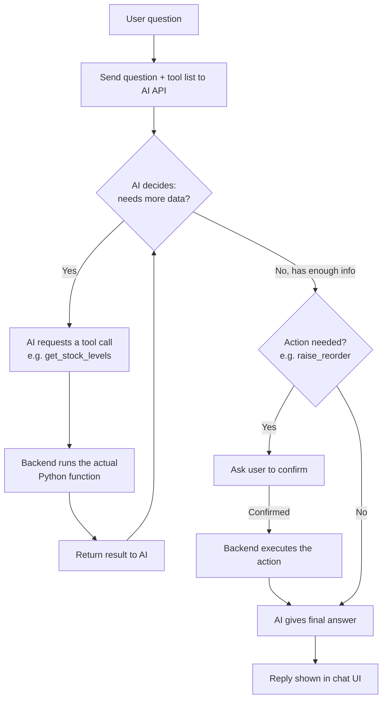
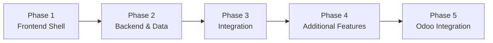

# Implementation

This document covers how we're actually building Jodo — project structure, the AI agent's internals, the development roadmap, and how to run it locally.

---

## 1. Project Structure

```text
jodo/
│
├── app.py                # Flask entry point — routes, including /api/agent/query
├── ai_agent.py            # AI client setup, tool definitions, run_tool()
├── mock_data.py            # Mock operational data (Phase 1)
├── odoo_client.py           # Odoo XML-RPC client (Phase 2+)
├── requirements.txt
├── .env                     # ANTHROPIC_API_KEY (not committed)
├── .env.example
├── README.md
│
├── docs/
│   ├── ARCHITECTURE.md
│   ├── FEATURES.md
│   └── IMPLEMENTATION.md      # this file
│
├── templates/
│   ├── dashboard.html
│   ├── channels.html
│   └── agent.html              # AI agent chat interface
│
└── static/
    ├── style.css
    └── script.js                # includes fetch() call to /api/agent/query
```

---

## 2. Implementing the AI Agent — Tools & Loop

The agent is given a set of **tools** (functions) instead of one big prompt. It decides for itself which tools to call and in what order, based on the question — this is standard LLM **function calling**.

### 2.1 Tools we give it

| Tool | What it does |
|---|---|
| `get_stock_levels()` | Fetches current stock for all/specific products |
| `get_transfer_rate(product)` | Gets how fast a product is being used/sold |
| `check_alerts()` | Returns current low-stock/critical items |
| `raise_reorder(product, qty)` | Actually creates a reorder request |
| `notify_channel(channel, message)` | Posts a message to a team channel |

### 2.2 The agent loop



### 2.3 Worked example

```
User: "Which products run out before Friday, and reorder anything critical"

Agent's internal steps:
1. Calls get_stock_levels()        → gets current stock
2. Calls get_transfer_rate()        → gets usage speed
3. Reasons: "SKU-1042 hits zero in 2 days → critical"
4. Calls raise_reorder("SKU-1042", 50)   ← actually performs the action
5. Calls notify_channel("#low-stock-watch", "Reordered SKU-1042, 2 days of stock left")
6. Replies: "Done — found 1 critical item and raised a reorder for it."
```

### 2.4 Build checklist for this feature

| Piece | Where it lives | What it is |
|---|---|---|
| Tool functions | `ai_agent.py` | Normal Python functions that read/write mock data (or Odoo later) |
| Tool definitions | `ai_agent.py` | Descriptions telling the AI API what each tool does and what inputs it needs |
| Agent loop | `app.py` — `/api/agent/query` | Sends question + tools to the AI API, runs whichever tool the AI asks for, loops until a final answer |
| Confirmation step | `templates/agent.html` | Anything that *changes* data (like `raise_reorder`) shows a confirm popup before executing |

For the exact HTTP-level connection code (API key, request/response format), see `ARCHITECTURE.md` § 3.

We are **not** training our own model — we call a ready-made LLM API and ground it in live business data via tools. This is sometimes called *context injection* or *tool-augmented generation*, far lighter than training anything from scratch.

---

## 3. Development Roadmap



| Phase | Focus | Key Tasks |
|---|---|---|
| 1 — Frontend Shell | UI foundation | Dashboard layout, top nav, stat cards, stock panels, alerts, filters, responsive design |
| 2 — Backend & Data | Data plumbing | Flask routes, mock data, stock/transfer APIs, stock status calculations, alert generation |
| 3 — Integration | Wiring it up | Connect Flask + Jinja2, replace hardcoded values, display live stock/transfers/alerts, edge-case testing |
| 4 — Additional Features | New capabilities | Dashboard filters, team channels, WebSocket real-time updates, **AI agent**, dashboard customisation |
| 5 — Odoo Integration | Go live | Swap mock data layer for Odoo XML-RPC, validate against real ERP data |

---

## 4. Getting Started

```bash
# 1. Clone the repository
git clone https://github.com/your-org/jodo.git
cd jodo

# 2. Create a virtual environment
python -m venv venv

# Windows
venv\Scripts\activate
# macOS / Linux
source venv/bin/activate

# 3. Install dependencies
pip install -r requirements.txt

# 4. Set up environment variables
cp .env.example .env
# then edit .env and add your ANTHROPIC_API_KEY

# 5. Run the application
python app.py
```

Then open: **http://localhost:5000**

---

## 5. Team

| Member | Responsibility |
|---|---|
| Team Member 1 | Project Lead, Documentation & AI Agent |
| Team Member 2 | Flask Backend & Odoo Integration |
| Team Member 3 | Frontend & Dashboard UI |
| Team Member 4 | Testing & Team Channel Features |

*(Replace placeholders with actual names.)*

---

## 6. Project Status

**Status: In Development** — building phase by phase, from the dashboard shell through backend/data, real-time features, the AI agent, and finally live Odoo integration.
