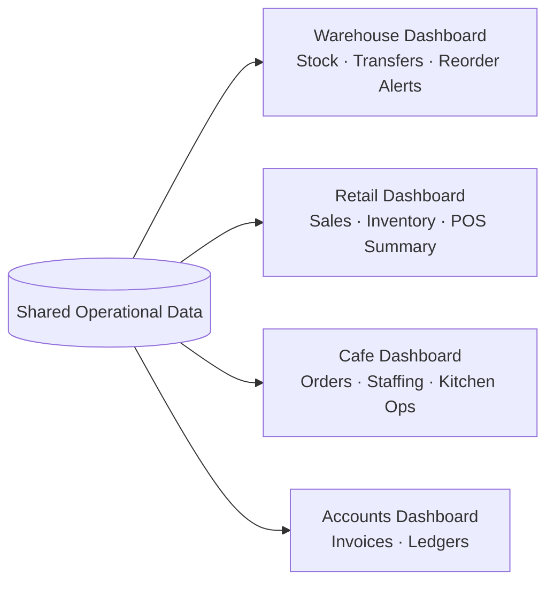
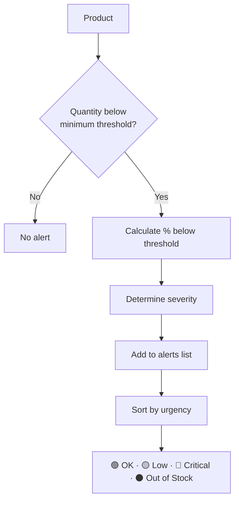

# Features

This document covers what Jodo actually does — the four core features and what each one delivers to the user.

---

## 1. Customisable Dashboards

Users add, remove, and reorder panels according to their role. The same underlying data is reshaped into completely different views per person.



**What's configurable:**
- Which panels are shown
- Order of panels
- Per-role default layouts

---

## 2. Team Networking

A lightweight, built-in chat layer so operational alerts reach the right people without switching to Slack/WhatsApp and back.

**Example channels:**
- `#general`
- `#dispatch-alerts`
- `#low-stock-watch`

Alerts generated by the system (e.g. a critical stock alert) can be automatically posted into the relevant channel, keeping the whole team in sync without manual reporting.

---

## 3. AI Operations Agent

Users ask questions in plain language and the agent answers using live operational data — and can go a step further and take action.

### 3.1 What it can do

| Capability | Example |
|---|---|
| Answer questions | "Which products are going to run out before Friday?" |
| Flag risks | Surfaces critical stock before it becomes a stockout |
| Suggest actions | "Raise a reorder for SKU-1042" |
| Take action (with confirmation) | Actually raises the reorder, notifies a channel |

### 3.2 Example interaction

```
User:  Which products are going to run out before Friday?

Agent: Based on current transfer volume, 3 products are at risk:
       🔴 SKU-1042 (Steel Bolts)   — 2 days left
       🟡 SKU-2291 (Packing Tape) — 4 days left
       🟡 SKU-3310 (Gloves, L)    — 5 days left

       Suggested action: Raise a reorder for SKU-1042 today to avoid
       a stockout before Friday's dispatch.
       [Raise Reorder]  [Notify #low-stock-watch]
```

### 3.3 Chatbot vs Agent

A plain chatbot only answers questions. Jodo's AI is built as an **agent** — it can look things up itself and take actions, not just talk about them. See `IMPLEMENTATION.md` for exactly how this is built (tools, function calling, the agent loop).

---

## 4. Low-Stock Alert System

Jodo identifies products whose quantity falls below their minimum required quantity, and ranks them by urgency.



- Most urgent products are shown first on the dashboard.
- The AI agent uses this same severity logic when answering stock-related questions, so the dashboard and the agent never disagree on what's "critical."

---

## Feature Summary

| Feature | Solves |
|---|---|
| Customisable Dashboards | Information overload — everyone sees only what's relevant to their role |
| Team Networking | Constant tool-switching between ERP and chat apps |
| AI Operations Agent | Manually building reports to answer simple operational questions |
| Low-Stock Alert System | Stockouts caught too late |
