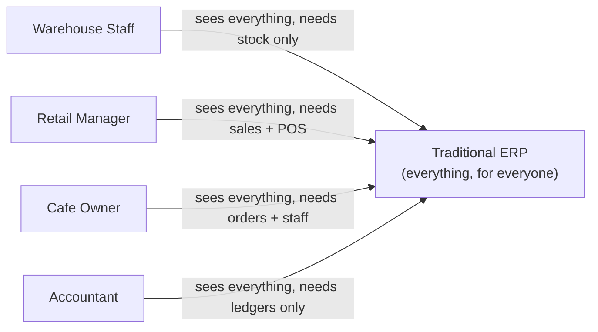
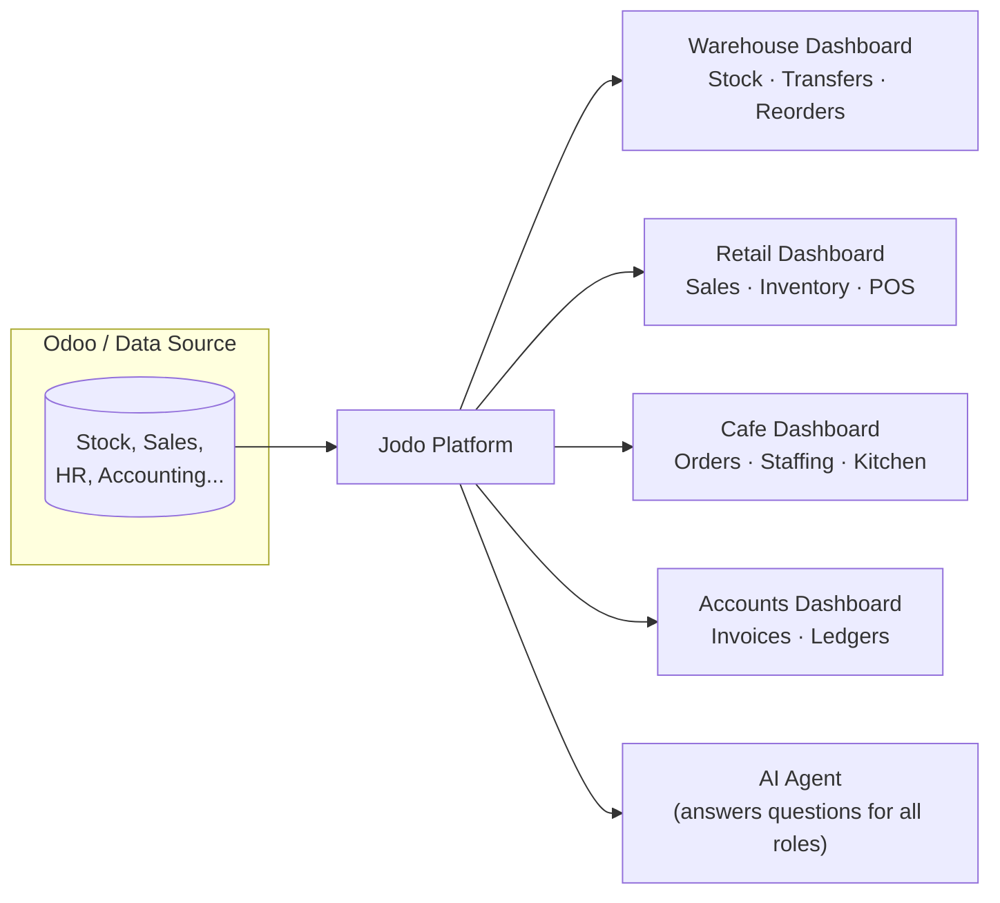
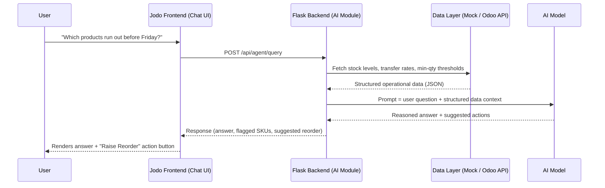
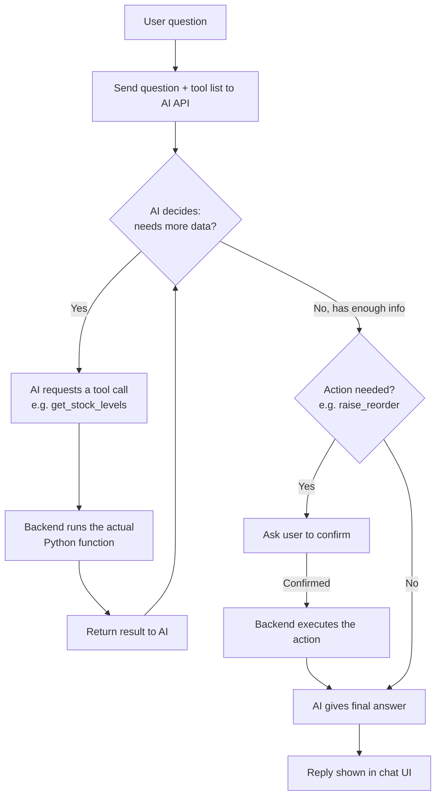
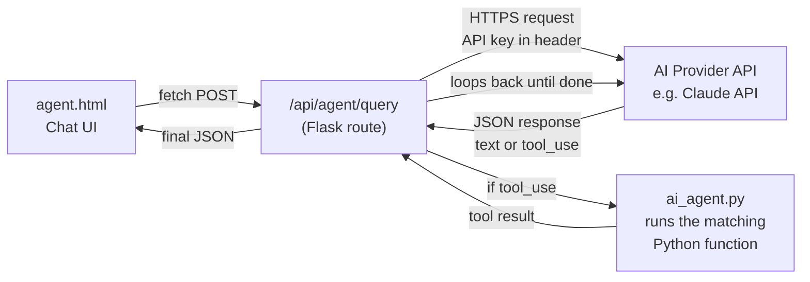
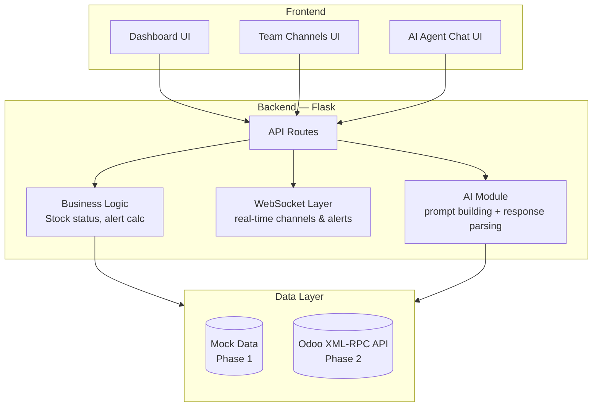
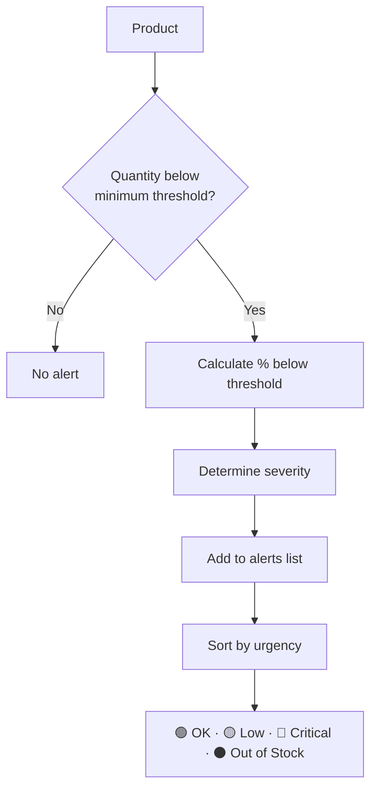
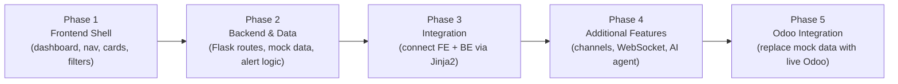

# Jodo — Business Operations Platform

> **Not just another ERP dashboard.**

Jodo is a role-specific, AI-assisted, and customisable business operations platform built on top of Odoo. It replaces one giant, one-size-fits-all ERP screen with a **dashboard tailored to each role**, a **team communication layer**, and an **AI operations agent** that can answer questions about the business in plain language.

---

## 1. The Problem

Traditional ERPs (Odoo, SAP, etc.) bundle dozens of modules — CRM, Sales, Accounting, HR, Manufacturing, Inventory, POS, Marketing — into a single interface.

A warehouse worker, a cafe owner, a retail manager, and an accountant all log into the *same* screen, even though each of them cares about a completely different 10% of the data.



**Result:** information overload, slow onboarding, and everyone building their own spreadsheets on the side just to see "their" data.

---

## 2. The Solution — Jodo's Approach

Jodo sits on top of Odoo (or mock data during development) and reshapes the same underlying data into **role-specific views**, adds a **chat-style team layer**, and gives everyone an **AI agent** to query operations in natural language instead of building reports manually.



**Formula:**
`Your Role → Your Dashboard → Your Data → Your AI Assistant`

---

## 3. What We Are Building — Core Features

### 3.1 Customisable Dashboards
Users add, remove, and reorder panels. A warehouse manager might see Stock Levels, Transfers, Low-Stock Alerts, Reorder Suggestions — an accounts employee sees a totally different set of panels, all built from the same underlying data model.

### 3.2 Team Networking
A lightweight, built-in chat layer (channels like `#general`, `#dispatch-alerts`, `#low-stock-watch`) so operational alerts can be shared with the right people without switching to Slack/WhatsApp and back.

### 3.3 AI Operations Agent
The AI agent reads live operational data and answers questions like:

> "Which products are going to run out before Friday based on current transfer volume?"

It doesn't just answer — it can also **flag risks** and **suggest actions** (e.g. "raise a reorder for SKU-2291").

---

## 4. How the AI Agent Works (Detailed)

The AI agent is not a general chatbot bolted on top — it's grounded in Jodo's own operational data. The flow is:



**Key design points:**

| Stage | What happens |
|---|---|
| **Grounding** | The agent is only given the operational data relevant to the question (stock, transfers, sales) — not the whole database — to keep answers accurate and fast. |
| **Reasoning** | The model calculates trends (e.g. burn rate of stock vs. days remaining) instead of just repeating raw numbers. |
| **Action suggestion** | Where relevant, the agent proposes a concrete next step (raise a reorder, alert a channel) rather than just reporting a problem. |
| **Human in the loop** | The agent suggests actions; a person still confirms/clicks to execute them (e.g. actually placing the reorder). |

### Example interaction

```
User:  Which products are going to run out before Friday?

Agent: Based on current transfer volume, 3 products are at risk:
       🔴 SKU-1042 (Steel Bolts)   — 2 days left
       🟡 SKU-2291 (Packing Tape) — 4 days left
       🟡 SKU-3310 (Gloves, L)    — 5 days left

       Suggested action: Raise a reorder for SKU-1042 today to avoid
       a stockout before Friday's dispatch.
       [Raise Reorder]  [Notify #low-stock-watch]
```

---

## 5. Chatbot vs Agent — Why We Call It an "Agent"

A plain chatbot only answers questions. An **agent** can look things up itself and *take actions* — not just talk about them. Jodo's AI is built as an agent: we don't manually fetch data and stuff it into one prompt every time. Instead, the agent is given a set of **tools** (functions) and decides for itself which ones to call, in what order, based on the user's question.

### 5.1 Tools given to the agent

| Tool | What it does |
|---|---|
| `get_stock_levels()` | Fetches current stock for all/specific products |
| `get_transfer_rate(product)` | Gets how fast a product is being used/sold |
| `check_alerts()` | Returns current low-stock/critical items |
| `raise_reorder(product, qty)` | Actually creates a reorder request |
| `notify_channel(channel, message)` | Posts a message to a team channel |

We don't hardcode "if user asks X, run Y" logic — we just build the tools and describe them to the AI API (most LLM APIs support this natively, called **function calling / tool use**). The model decides which tools it needs.

### 5.2 The agent loop



### 5.3 Worked example

```
User: "Which products run out before Friday, and reorder anything critical"

Agent's internal steps:
1. Calls get_stock_levels()        → gets current stock
2. Calls get_transfer_rate()        → gets usage speed
3. Reasons: "SKU-1042 hits zero in 2 days → critical"
4. Calls raise_reorder("SKU-1042", 50)   ← actually performs the action
5. Calls notify_channel("#low-stock-watch", "Reordered SKU-1042, 2 days of stock left")
6. Replies: "Done — found 1 critical item and raised a reorder for it."
```

### 5.4 What this means for the build

| Piece | Where it lives | What it is |
|---|---|---|
| Tool functions | `ai_agent.py` (new file) | Normal Python functions that read/write mock data (or Odoo later) |
| Tool definitions | `ai_agent.py` | Descriptions telling the AI API what each tool does and what inputs it needs |
| Agent loop | `app.py` — route `/api/agent/query` | Sends question + tools to the AI API, runs whichever tool the AI asks for, loops until a final answer comes back |
| Confirmation step | `templates/agent.html` | Anything that *changes* data (like `raise_reorder`) shows a confirm popup — the AI doesn't act without a human okay |

We are **not** training our own model. We call a ready-made LLM API (e.g. Claude API) and give it live business data + tools through this loop — this is sometimes called *context injection* or *tool-augmented generation*, and it's far lighter than training anything from scratch.

---

## 6. How We Actually Connect to the AI (API-level)

This is the plumbing behind Section 5 — how Flask talks to the AI provider.

### 6.1 Connection overview



### 6.2 What's needed to connect

| Item | Purpose |
|---|---|
| API key | Stored in `.env` (never committed) — e.g. `ANTHROPIC_API_KEY=...` |
| HTTPS endpoint | The provider's chat/completions endpoint, called over standard `requests`/`httpx` from Flask |
| Tool schema | JSON description of each tool (`get_stock_levels`, `raise_reorder`, etc.) sent along with every request so the AI knows what it can call |
| `.env.example` | Shows the required variable names without exposing real keys |

### 6.3 Simplified connection code (Flask side)

```python
# ai_agent.py
import os, requests

API_KEY = os.getenv("ANTHROPIC_API_KEY")
API_URL = "https://api.anthropic.com/v1/messages"

TOOLS = [
    {"name": "get_stock_levels", "description": "Get current stock for products", "input_schema": {...}},
    {"name": "raise_reorder", "description": "Create a reorder request", "input_schema": {...}},
    # ...other tools
]

def ask_agent(user_message, conversation_history):
    response = requests.post(
        API_URL,
        headers={
            "x-api-key": API_KEY,
            "content-type": "application/json"
        },
        json={
            "model": "claude-sonnet-4-6",
            "max_tokens": 1000,
            "messages": conversation_history + [{"role": "user", "content": user_message}],
            "tools": TOOLS
        }
    )
    return response.json()
```

```python
# app.py
from ai_agent import ask_agent, run_tool

@app.route("/api/agent/query", methods=["POST"])
def agent_query():
    user_message = request.json["message"]
    history = []

    result = ask_agent(user_message, history)

    # loop: keep calling tools until AI gives a final text answer
    while result_has_tool_call(result):
        tool_name, tool_input = extract_tool_call(result)
        tool_output = run_tool(tool_name, tool_input)   # runs our Python function
        history.append({"role": "assistant", "content": result["content"]})
        history.append({"role": "user", "content": tool_output})
        result = ask_agent(user_message, history)

    return jsonify(final_answer=extract_text(result))
```

### 6.4 Key points about the connection

- **One request per "thinking step"** — the loop above sends a request, checks if the AI wants a tool, runs it, sends the result back, and repeats until the AI is ready to answer in plain text.
- **API key is server-side only** — the frontend never talks to the AI API directly, it only talks to our own Flask route (`/api/agent/query`), keeping the key safe.
- **Mock data first** — during Phase 1–3, `run_tool()` reads from `mock_data.py`; in Phase 5 it's swapped to call `odoo_client.py` instead, without changing anything about how the AI connects.
- **Real-time delivery** — once a final answer is ready, it can either be returned directly (simple HTTP response) or pushed over WebSocket if we want live "typing" style updates in the chat UI.

---

## 7. System Architecture



### Stack

| Layer | Technology |
|---|---|
| Frontend | HTML, CSS, JavaScript, Jinja2 templates |
| Backend | Python, Flask |
| Real-time | WebSocket / Polling |
| AI | AI Operations Agent (LLM + grounded operational data) |
| Data | Mock data (Phase 1) → Odoo XML-RPC API (Phase 2) |
| ERP Integration | Odoo |

---

## 8. Low-Stock Alert Logic



The most urgent products surface first on the dashboard, and the AI agent uses this same severity logic when answering stock-related questions.

---

## 9. Development Roadmap



| Phase | Focus | Key Tasks |
|---|---|---|
| 1 — Frontend Shell | UI foundation | Dashboard layout, top nav, stat cards, stock panels, alerts, filters, responsive design |
| 2 — Backend & Data | Data plumbing | Flask routes, mock data, stock/transfer APIs, stock status calculations, alert generation |
| 3 — Integration | Wiring it up | Connect Flask + Jinja2, replace hardcoded values, display live stock/transfers/alerts, edge-case testing |
| 4 — Additional Features | New capabilities | Dashboard filters, team channels, WebSocket real-time updates, **AI agent**, dashboard customisation |
| 5 — Odoo Integration | Go live | Swap mock data layer for Odoo XML-RPC, validate against real ERP data |

---

## 10. Project Structure

```text
jodo/
│
├── app.py                # Flask entry point
├── mock_data.py           # Mock operational data (Phase 1)
├── odoo_client.py          # Odoo XML-RPC client (Phase 2+)
├── requirements.txt
├── .env.example
├── README.md
│
├── templates/
│   ├── dashboard.html
│   ├── channels.html
│   └── agent.html          # AI agent chat interface
│
└── static/
    ├── style.css
    └── script.js
```

---

## 11. Getting Started

```bash
# 1. Clone the repository
git clone https://github.com/your-org/jodo.git
cd jodo

# 2. Create a virtual environment
python -m venv venv

# Windows
venv\Scripts\activate
# macOS / Linux
source venv/bin/activate

# 3. Install dependencies
pip install -r requirements.txt

# 4. Run the application
python app.py
```

Then open: **http://localhost:5000**

---

## 12. Team

| Member | Responsibility |
|---|---|
| Team Member 1 | Project Lead, Documentation & AI Agent |
| Team Member 2 | Flask Backend & Odoo Integration |
| Team Member 3 | Frontend & Dashboard UI |
| Team Member 4 | Testing & Team Channel Features |

*(Replace placeholders with actual names.)*

---

## 13. Project Status

**Status: In Development** — building phase by phase, from the dashboard shell through backend/data, real-time features, the AI agent, and finally live Odoo integration.

---

## 14. Vision

> **Your role → Your dashboard → Your data → Your AI assistant**

Jodo's long-term goal is to make ERP systems accessible by surfacing only what each person actually needs — with an AI agent that turns raw operational data into answers and actions, instead of requiring everyone to build their own reports.

---

## References

* Odoo — XML-RPC External API
* G2 — Odoo ERP Reviews
* Trustpilot — Odoo Reviews

---

<div align="center">

**Jodo**
*Built on Odoo · Simplified for every role*

</div>