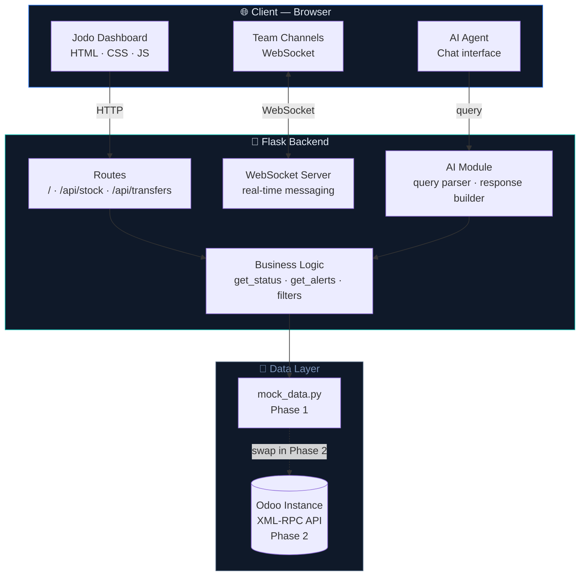
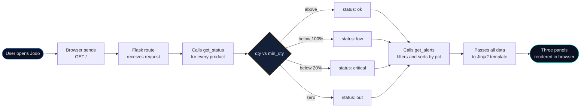
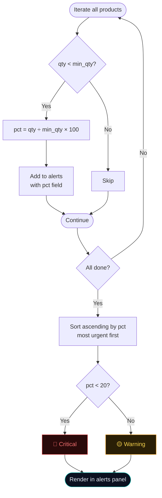

<div align="center">


<br/><br/>


<br/><br/>


### Not just another ERP dashboard.
### A role-specific, AI-assisted, fully customisable operations platform — built for every kind of business.

<br/>

</div>

---

## ⚡ The Problem with Odoo (and every ERP like it)

```
┌───────────────────────────────────────────────────────────────────[...]
│                  ODOO — full admin interface                      │
│                                                                  │
│  CRM │ Sales │ Accounting │ HR │ Manufacturing │ Helpdesk │ ...  │
│                                                                  │
│         ↕  every user, every role, sees ALL of this  ↕          │
│                                                                  │
│  Inventory │ Transfers │ Payroll │ POS │ Marketing │ Repairs ... │
└───────────────────────────────────────────────────────────────────[...]

  A warehouse worker. A retail manager. A restaurant owner.
  A freelance agency. All given the same cluttered interface.
  All forced to navigate what they don't need to reach what they do.

                           ↓  Jodo fixes this  ↓

┌──────────────┬───────────────────┬────────────────────────────────[...]
│  Your role   │  Your dashboards  │  Your data — nothing extra   │
│  Your layout │  Your AI agent    │  Connected. Clean. Fast.     │
└──────────────┴───────────────────┴────────────────────────────────[...]
```

---

## 🎯 Who Is Jodo For?

```
                            ┌─────────────┐
                            │    JODO     │
                            │  Platform   │
                            └──────┬──────┘
           ┌──────────────┬────────┼────────┬──────────────┐
           ▼              ▼        ▼         ▼              ▼
    ┌────────────┐ ┌──────────┐ ┌──────┐ ┌──────────┐ ┌──────────┐
    │ Warehouse  │ │  Retail  │ │ Cafe │ │ Agency / │ │  Any SME │
    │ & Logistics│ │  Store   │ │  &   │ │Freelance │ │ that runs│
    │            │ │ Manager  │ │ Food │ │  Team    │ │ on Odoo  │
    └────────────┘ └──────────┘ └──────┘ └──────────┘ └──────────┘
    Stock levels   Sales today  Orders   Project       Custom
    Transfers      Inventory    Kitchen  pipeline      role view
    Reorder alerts POS summary  Staffing Invoices      AI agent
```

Each business type gets its own configured dashboard. No two Jodo setups need to look the same.

---

## ✨ Core Features

### 1 — Customisable Dashboards

```
┌─────────────────────────────────────────────────┐
│  Jodo Dashboard Builder                         │
│                                                 │
│  [ Stock Panel  ▓▓▓▓▓▓▓▓░░ ]  [ + Add panel ]  │
│  [ Transfers    ▓▓▓▓░░░░░░ ]                    │
│  [ Alerts       ▓▓▓▓▓▓░░░░ ]  drag to reorder  │
│                                                 │
│  Role: Warehouse Manager ▾                      │
│  Saved layouts: Morning view / Dispatch view    │
└─────────────────────────────────────────────────┘
```

Users can add, remove, and reorder panels. Layouts save per role and per user. A warehouse manager's morning view looks nothing like an accountant's closing view — and both are built from the same p[...]

---

### 2 — Team Networking (Discord-style)

```
┌─────────────────────────────────────────────┐
│  Jodo Workspace                             │
│                                             │
│  # general          ● Ravi (Warehouse)      │
│  # dispatch-alerts  ● Priya (Accounts)      │
│  # low-stock-watch  ○ Arjun (offline)       │
│                                             │
│  [🔴 ALERT] Corner Protectors — 5 units    │
│  Ravi: on it, reorder submitted             │
│  Priya: invoice raised ✓                   │
│                                             │
│  [ type a message...              ] [send]  │
└─────────────────────────────────────────────┘
```

Persistent, role-aware team channels embedded directly in the platform. Alerts from the dashboard post automatically into the relevant channel. No switching between Slack, WhatsApp, and the ERP.

---

### 3 — AI Operations Agent

```
┌──────────────────────────────────────────────┐
│  Jodo AI Agent                               │
│                                              │
│  You: "Which products are going to run out   │
│         before Friday based on current       │
│         transfer volume?"                    │
│                                              │
│  Agent: Based on today's pending transfers,  │
│  Corner Protectors (5 units, 3 outgoing)     │
│  and Air Pillows (0 units) will hit zero     │
│  before Friday. Shall I raise a reorder?     │
│                                              │
│  [ Yes, raise reorder ] [ Show me the data ] │
└──────────────────────────────────────────────┘
```

The AI agent reads live dashboard data and answers natural language questions about operations. It can flag patterns, suggest reorders, and summarise daily status — without the user building a singl[...]

---

## 🏗️ System Architecture



---

## 🔄 Request Flow — How a Dashboard Load Works



---

## 🧠 Low-Stock Alert Logic



---

## 🛠️ How We Are Building It

### Frontend → Backend → Integration

```
PHASE 1 — Frontend shell (Week 1–2)
─────────────────────────────────────────────────────
  Person 3 builds dashboard.html + style.css
  · Topbar, stat cards, three panels
  · Status tag colours (ok / low / critical / out)
  · Filter buttons (All / In stock / Low / Critical)
  · Static mock values hardcoded in HTML for now
  · Goal: looks exactly like the design, no Flask yet

PHASE 2 — Backend + data layer (Week 1–2, parallel)
─────────────────────────────────────────────────────
  Person 2 builds app.py + mock_data.py
  · Flask routes returning JSON from mock data
  · get_status() and get_alerts() logic tested in terminal
  · No HTML involved yet — just clean data in and data out
  · Goal: curl localhost:5000/api/stock returns correct JSON

PHASE 3 — Integration (Week 3)
─────────────────────────────────────────────────────
  Person 2 + Person 3 connect the two halves
  · Replace hardcoded HTML values with Jinja2 template tags
  · Flask passes stock, transfers, alerts, stats to template
  · Person 4 tests edge cases: zero stock, empty transfers,
    all items critical
  · Goal: one working end-to-end dashboard on localhost

PHASE 4 — Features (Week 4–5)
─────────────────────────────────────────────────────
  · script.js: filter buttons work client-side
  · Team channel UI (WebSocket or polling)
  · AI agent query box (reads live dashboard state)
  · Dashboard layout customisation (add / remove panels)

PHASE 5 — Odoo API swap + polish (Week 6)
─────────────────────────────────────────────────────
  · Replace mock_data.py with odoo_client.py
  · Connect to Odoo demo instance via XML-RPC
  · Final UI polish, demo rehearsal, freeze
```

---

## 📁 Project Structure

```
jodo/
│
├── 🐍  app.py                ← Flask routes, business logic
├── 📦  mock_data.py          ← Sample data (Phase 1–3)
├── 🔌  odoo_client.py        ← Odoo XML-RPC connector (Phase 5)
├── 📋  requirements.txt
├── 🔐  .env.example
│
├── templates/
│   ├── 🖥️  dashboard.html    ← Main three-panel view
│   ├── 💬  channels.html     ← Team networking view
│   └── 🤖  agent.html        ← AI agent interface
│
└── static/
    ├── 🎨  style.css         ← Dark cool palette, status colours
    └── ⚡  script.js         ← Filters, WebSocket, agent queries
```

---

## 🚀 Get Running in 60 Seconds

```bash
# Clone
git clone https://github.com/your-org/jodo.git && cd jodo

# Virtual environment
python -m venv venv && source venv/bin/activate

# Install
pip install -r requirements.txt

# Run
python app.py
```

Open **`http://localhost:5000`**

---

## 👥 Team

| Member | Responsibility |
|---|---|
| [Name] | Project lead · report · documentation · AI agent design |
| [Name] | Flask backend · data logic · Odoo API integration |
| [Name] | HTML/CSS frontend · dashboard UI · responsive design |
| [Name] | Testing · edge cases · team channel feature · script.js |

---

## 📎 References

- Odoo. (2025). *XML-RPC external API.* https://www.odoo.com/documentation/17.0/developer/reference/external_api.html
- G2. (2026). *Odoo ERP reviews.* https://www.g2.com/products/odoo-odoo-erp/reviews
- Trustpilot. (2026). *Odoo reviews.* https://www.trustpilot.com/review/odoo.com

---

<div align="center">
<sub>Built on Odoo · Simplified for every role · Course project — Digital Business Systems</sub>
</div>
